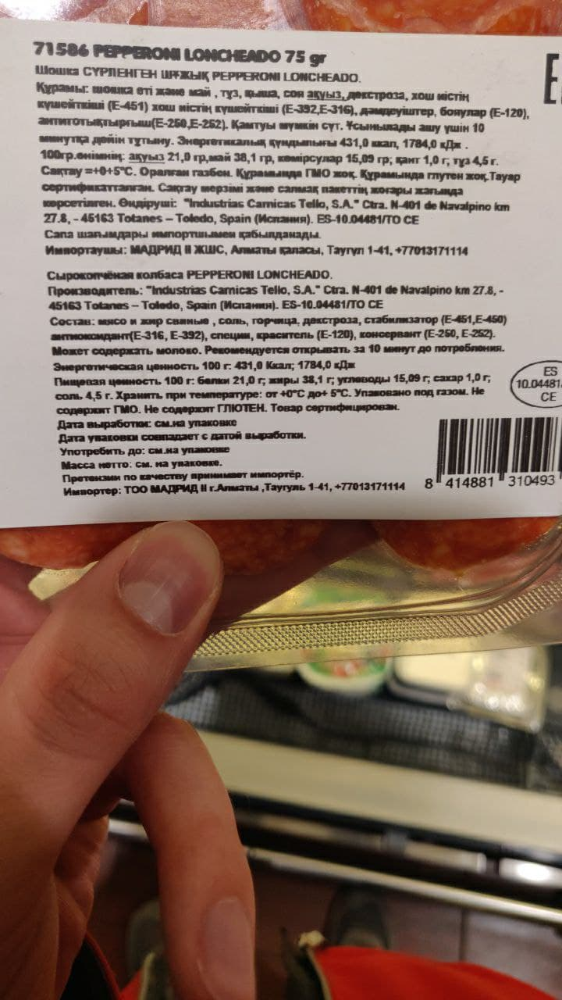
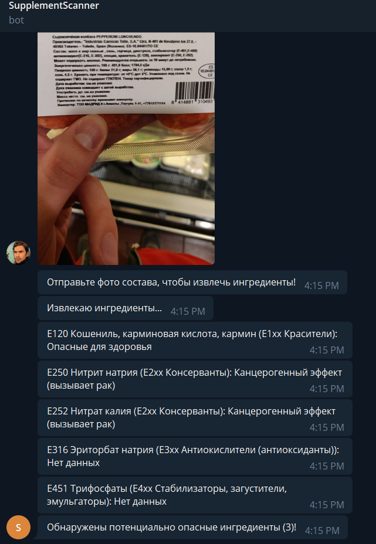

# Ingredient Scanner

Telegram bot that scans food products for potentially harmful supplements.

**Note**: Currently supports product labels written in Russian.

  
   

## TODO

* Improve OpenCV preprocessing pipeline
* Add full support for English product labels